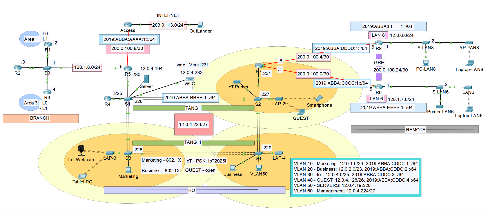
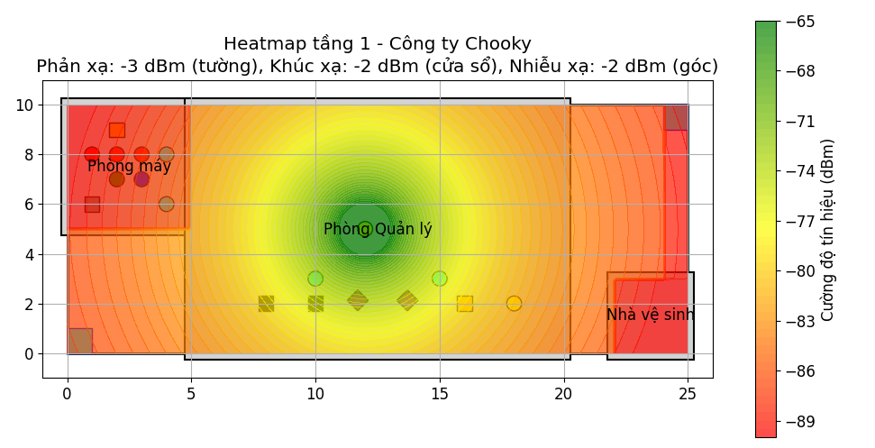
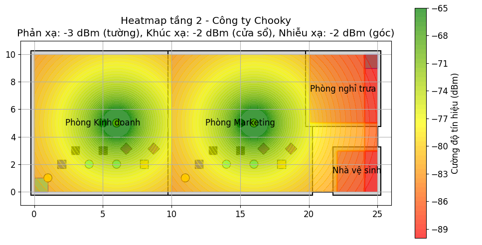

### Giới thiệu
**Tác giả:** Võ Mạnh Cường – MSSV: 52200319  

**Biệt danh:** Chooky  
**Lớp:** 22050401 – Khoa Công nghệ Thông tin  

**Trường Đại học Tôn Đức Thắng**  

**Môn học:** An Toàn Mạng Không Dây và Di Động

**Giảng viên hướng dẫn:** TS. Bùi Quy Anh

**Ngày hoàn thành:** 21/05/2025  

---
## 🧭 Tổng quan

Dự án này trình bày quá trình **thiết kế, cấu hình và kiểm thử một hệ thống mạng doanh nghiệp toàn diện cho "Công ty Chooky"**, tích hợp song song IPv4 và IPv6, nhằm đáp ứng các yêu cầu về:

* Định tuyến nội bộ với **EIGRP (HQ)** và **OSPF (Branch)**.
* Chuyển mạch đa tầng với **VLAN, VTP, EtherChannel, Rapid PVST+**.
* Liên kết WAN với **PPP (PAP/CHAP)** và **GRE Tunnel**.
* Triển khai **Mạng không dây (WLAN)** với **Wireless LAN Controller (WLC)**.
* Bảo mật WiFi đa cấp: **WPA2-Enterprise (802.1X) với RADIUS Server**, **WPA2-PSK**, và mạng **Guest (Open)**.
* Bảo mật kết nối từ xa với **VPN IPsec** (ESP, AES 256).
* Phân tích **độ phủ sóng (Heatmap)** và suy hao tín hiệu cho 2 tầng văn phòng.
* Dịch vụ mạng: **NAT, DHCP, ACL**.
* Địa chỉ hóa và định tuyến **IPv6**, cùng **DHCPv6**.
* Quản trị an toàn bằng **SSH**.

Mục tiêu là tạo ra **một hệ thống mạng doanh nghiệp mô phỏng đầy đủ chức năng**, đảm bảo **ổn định, bảo mật cao, dễ mở rộng và hỗ trợ cả IPv4/IPv6**.

---

## 🗺️ Kiến trúc hệ thống

  

Hệ thống được chia làm ba khu vực chính:

### 🏢 Trụ sở chính (HQ)
* Các router: **R4, R6, R7, R8** và các switch: **S1–S4**.
* Định tuyến: **EIGRP (AS 100)**.
* Liên kết giữa router–switch thông qua **Router-on-a-Stick** tại R4.
* **Triển khai WLAN tập trung** với **WLC** và các **Lightweight AP (LAP)**, quản lý qua **VLAN 60 (Management)**.
* Máy chủ **RADIUS Server (12.0.4.194)** tại VLAN 50 (SERVERS) cho xác thực AAA (802.1X).
* Dịch vụ mạng: **DHCP, ACL, SSH**.

### 🏬 Chi nhánh (Branch)
* Router: **R1, R2, R3, R5**.
* Định tuyến: **OSPF đa khu vực**.
* R5: Router biên kết nối HQ ↔ Internet, thực hiện **redistribution giữa OSPF và EIGRP**.
* Dịch vụ mạng: **NAT Overload** và **Port Forwarding** tại router ACCESS.

### 📶 Mạng không dây (WLAN)
Hệ thống cung cấp 4 SSID cho các mục đích sử dụng khác nhau, được quản lý tập trung bởi WLC:
1.  **Marketing (VLAN 10):** Bảo mật **WPA2-Enterprise (802.1X)**, xác thực qua RADIUS Server.
2.  **Business (VLAN 20):** Bảo mật **WPA2-Enterprise (802.1X)**, xác thực qua RADIUS Server.
3.  **IoT (VLAN 30):** Bảo mật **WPA2-PSK** (Mật khẩu: `IoT2025!`).
4.  **GUEST (VLAN 40):** Mạng **Open (Không bảo mật)**, bị cô lập khỏi mạng nội bộ (chỉ ra Internet) bằng ACL.

---
## 📡 Phân tích độ phủ sóng (Heatmaps)

Hệ thống mạng không dây được thiết kế để phủ sóng toàn bộ 2 tầng của trụ sở (tổng diện tích 500m²). 3 Access Point (1 ở Tầng 1, 2 ở Tầng 2) được bố trí dựa trên phân tích suy hao tín hiệu (Path Loss), bao gồm suy giảm do tường bê tông (-3 dBm), cửa sổ kính (-2 dBm) và nhiễxạ góc (-2 dBm) để đảm bảo kết nối ổn định và giảm thiểu điểm chết.

  
  

---
## ⚙️ Các công nghệ và kỹ thuật chính

| Thành phần | Mô tả |
|---|---|
| **Định tuyến IPv4** | EIGRP tại HQ, OSPF đa khu vực tại chi nhánh, redistribution tại R5. |
| **Định tuyến IPv6** | EIGRP for IPv6, static default route, inter-VLAN routing. |
| **Chuyển mạch** | VLAN, VTP Server/Client, EtherChannel (LACP), Rapid-PVST+. |
| **WAN** | PPP (PAP/CHAP), GRE Tunnel giữa R6–R8. |
| **Mạng không dây (WLAN)** | **Wireless LAN Controller (WLC)**, Lightweight APs (LAP), 4 SSIDs, quản lý qua VLAN 60. |
| **Bảo mật WLAN** | **WPA2-Enterprise (802.1X)**, **WPA2-PSK**, **RADIUS (AAA) Server**. |
| **Bảo mật VPN** | **IPsec (ESP, AES 256, SHA-HMAC)** bảo mật kết nối giữa R6-R7 và R7-R8. |
| **Dịch vụ mạng** | NAT Overload, Port Forwarding, DHCPv4, DHCPv6, ACL bảo mật. |
| **Quản trị** | SSH, Access Control List, hostname và domain riêng. |
| **Prefix IPv6** | `2019:ABBA:CDDC::/48` chia /64 cho từng VLAN. |
| **Thiết bị mô phỏng** | Router Cisco, Switch Cisco, WLC-PT, LAP-PT, Server-PT. |

---

### Hướng dẫn sử dụng báo cáo và file cấu hình

Báo cáo mô tả chi tiết **thiết kế, phân bổ địa chỉ, cấu hình và kết quả kiểm thử**.  

File cấu hình Packet Tracer (pkt) đi kèm chứa mô hình mạng tương ứng, bao gồm các router, switch, WLC, AP và thiết bị cuối, được thiết lập dựa trên các phần đã mô tả trong báo cáo.

### Nội dung file cấu hình
* **Tên file**: `configuration.pkt` 

* **Phiên bản Packet Tracer**: Được tạo và kiểm tra trên Packet Tracer.
* **Cấu hình chính**:
    * Kết nối PPP, GRE tunnel.
    * Định tuyến OSPF (Branch) và EIGRP (HQ) cho cả IPv4/IPv6.
    * Chuyển mạch với VLAN, VTP, Rapid PVST+, và EtherChannel.
    * NAT, DHCP, và ACL cho IPv4.
    * DHCPv6 cho IPv6.
    * **WLAN:** WLC, 4 SSIDs (Marketing, Business, IoT, GUEST).
    * **Security:** RADIUS Server, VPN IPsec, SSH.

### Hướng dẫn sử dụng
1.  **Mở file**: Sử dụng Packet Tracer để mở file pkt. Đảm bảo phiên bản phần mềm tương thích.
2.  **Kiểm tra cấu hình**:
    * Vào chế độ CLI trên từng thiết bị (router, switch, WLC) để xem các lệnh cấu hình bằng cách nhập `show running-config`.
    * Truy cập WLC qua Web Browser từ PC trong VLAN 60 (Management) với địa chỉ `https://12.0.4.232`.
    * Kiểm tra kết nối bằng lệnh `ping` giữa các thiết bị.
    * Xem bảng định tuyến với `show ip route` (IPv4) hoặc `show ipv6 route` (IPv6).
3.  **Thử nghiệm**:
    * **WLAN:** Kết nối thiết bị cuối (Laptop, Smartphone) vào các SSID.
        * *Marketing/Business:* Thử xác thực 802.1X (ví dụ: user: `business01`, pass: `business01`).
        * *IoT:* Thử xác thực PSK (pass: `IoT2025!`).
        * *GUEST:* Kiểm tra kết nối Open và xác minh bị ACL chặn truy cập mạng nội bộ (ví dụ: `ping 12.0.4.194` sẽ thất bại).
    * **NAT:** Ping từ host nội bộ ra Internet (ví dụ: `ping 203.0.113.1`).
    * **Port Forwarding:** Truy cập Web Server từ PC "OutLander" (bên ngoài Internet) qua địa chỉ `http://203.0.113.1`.
    * **DHCP:** Kiểm tra host có nhận IP động (cả v4 và v6).
    * **VPN:** Kiểm tra trạng thái IPsec trên R6, R7, R8 (lệnh `show crypto isakmp sa` và `show crypto ipsec sa`).
    * **SSH:** Kết nối quản trị thiết bị từ VLAN SERVERS (ví dụ: từ Server SSH vào S1).

---
## 📈 Kết quả và hướng mở rộng

### ✅ Kết quả đạt được
* Hệ thống có dây (IPv4/IPv6) hoạt động ổn định, định tuyến và NAT chính xác.
* DHCP/DHCPv6 cấp phát IP tự động cho các VLAN.
* Hệ thống WLAN hoạt động ổn định, 4 SSIDs cung cấp kết nối và phân vùng chính xác theo VLAN.
* Xác thực 802.1X qua RADIUS server thành công, tăng cường bảo mật cho mạng nội bộ.
* GRE Tunnel và VPN IPsec giữa R6-R8 đảm bảo kết nối xuyên vùng an toàn.
* ACL kiểm soát truy cập hiệu quả, cô lập mạng GUEST và IoT, đảm bảo tính bảo mật.

### 🚀 Hướng phát triển
* Triển khai **NAT64** để cải thiện khả năng tương thích và giao tiếp giữa các thiết bị chỉ hỗ trợ IPv4 và IPv6.
* Nâng cấp hệ thống lên **WiFi 6/6E** và sử dụng **WPA3** để tăng cường hiệu suất và bảo mật không dây.
* Triển khai hệ thống giám sát thời gian thực **SIEM** (Security Information and Event Management) để phát hiện và phản ứng nhanh với các mối đe dọa.
* Tối ưu **QoS (Quality of Service)** cho các dịch vụ ưu tiên như họp trực tuyến (VoIP/Video Conference).

---

## 🔗 Tài nguyên liên quan dự án

* **📽️ Slide thuyết trình (Canva):**
    * [Nhấn vào đây để xem slides](https://www.canva.com/design/DAGn-AU1dLw/6NyfurXWwxICWmcNa5AZvw/view) 
    *(Lưu ý: Đã đổi link sang chế độ /view để người xem xem dễ dàng hơn)*

---
### Lưu ý
* Đảm bảo tất cả các thiết bị trong mô hình được bật nguồn (Power On) trước khi kiểm tra.
* Nếu gặp lỗi, kiểm tra lại kết nối cáp và trạng thái interface (lệnh `show ip interface brief`).
* Báo cáo PDF đi kèm cung cấp chi tiết về từng bước cấu hình và kết quả đạt được, vui lòng tham khảo để đối chiếu.

### Bản quyền
Bản báo cáo và file cấu hình này thuộc bản quyền của Võ Mạnh Cường - Copyright © Chooky. Mọi sao chép, phân phối hoặc sử dụng trái phép đều không được phép mà không có sự đồng ý bằng văn bản từ Võ Mạnh Cường.

### Thông tin liên hệ
* Tác giả: [Võ Mạnh Cường] AKA [Chooky].
* Mã số sinh viên: [52200319]
* Ngày hoàn thành: 21 tháng 5 năm 2025.
* Phản hồi: [vmcchooky@gmail.com],
            [facebook.com/chooky.vmc].